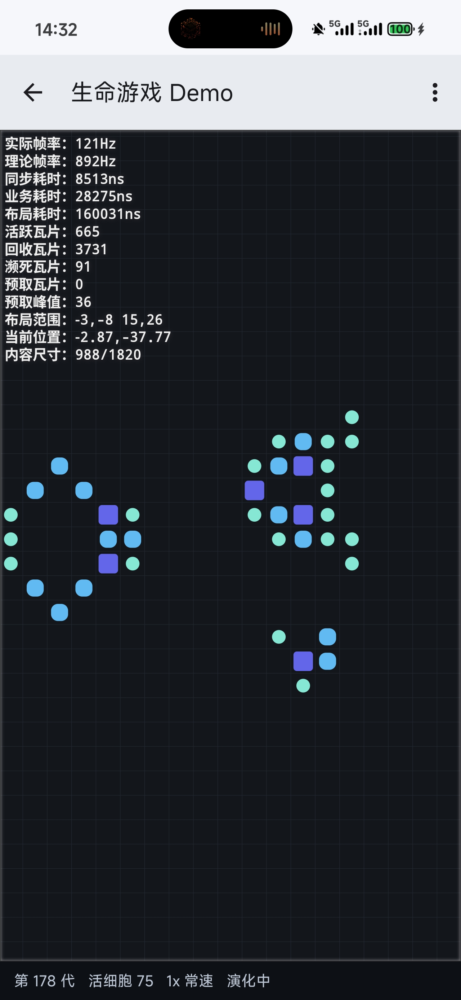

# Tile2D

Everything you see fits in one small square; everything else goes on forever.
You don't know where you are — doesn't matter. You're standing on solid ground.

---

[](https://jitpack.io/#kkaHeng/tile2d)

English | [汉语](README.md)

## Introduction

Tile2D is an Android 2D virtual container supporting the **full int32** index space.

Keywords: **tiles**, **grids**, **tables**, **2D**.

## Features

### Viewport Culling

Tiles outside the viewport are **not loaded** and **not rendered**. A `RecyclerView`-style **adapter pattern** keeps the learning effort low, because `RecyclerView` is a mountain no Android developer can walk around.

**Virtualized** rendering is the key to staying fast: it keeps performance from degrading linearly with total data volume — the basic requirement of any scrolling container.

### Dual Rendering Paradigms

Two **default** rendering paradigms are provided: `TileView` draws with `Canvas`, while `TileLayout` supports **native Views**.

Few UI frameworks tolerate more than one UI ecosystem — they either build their own UI stack or support native Views only. Being able to **choose** and **extend** rendering/interaction paradigms removes the **ecosystem migration cost**.

### Range Support

The adapter's **logical index range** covers the complete **int32** space — roughly **4.2 billion** per axis.

Traditional paradigms usually fail at the **extreme values** of **int32**, or even at **negative indices** altogether. That comes from **array thinking**, its **half-open interval** convention, and the habit of playing down the existence of **logical indices/coordinates**.

### Dying & Prefetch

Two caching strategies — the **dying zone** and the **prefetch zone**: **load ahead** the tiles that are about to enter the viewport, and **keep the most recent** tiles that have left it.

Tiles leaving the viewport are **staged**, so scrolling back can **skip rebinding** and revive them directly. Prefetch is **on by default**: it predicts the **direction of travel**, extends a strip only ahead of the viewport, and preloads it in batches (up to 8 per frame, tunable); tiles are promoted straight into the window, avoiding the stall of one big load.

### Variable Sizes

Supports **low-cost** resizing of individual rows and columns; resizing outside the window costs even less.

While resizing, a custom **alignment direction** keeps the row/column itself anchored while the other side **expands** or **shrinks**.

In many traditional paradigms **size** and **coordinates** are tightly coupled, so resizing triggers heavy **coordinate recalculation** and serious performance problems.

### Precision Safety

Pixel precision does not degrade while the window sits near the **int32** boundary or very far from **0**.

The one exception is a **single tile** hitting the **precision wall** head-on — and hardly any UI system supports textures that large anyway; splitting content across several tiles avoids it just as well.

Many traditional algorithms lose precision once you scroll far enough, which shows up as **visual jitter**: overlapping tiles, oversized gaps, distorted line widths.

### Container Replacement

The underlying **data containers** are replaceable in pursuit of a higher performance ceiling, including the **tile pool**, the **size table**, the **recycle pool** and more. Simple custom interfaces let you combine and swap in **third-party data structures**.

`HashMap`, for instance, is fast but pays for **boxing** and **unboxing**, whereas `SparseArray` avoids boxing yet is **slower**. The framework's **default** structure takes the strengths of both.

### Sparse Storage

It never tries to allocate memory for space it will not use — **sparse data** is supported across the whole chain, so `onCreateTileHolder` may **safely** return `null`.

Tile containers, size tables and other structures are all sparse: positions that are unused simply **do not exist**, rather than being stored as a plain `null`.

---

## Getting Started

### Adding the Dependency (Gradle)

Add this to the end of `repositories` in the `settings.gradle` file at your project root:
```gradle
dependencyResolutionManagement {
    repositoriesMode.set(RepositoriesMode.FAIL_ON_PROJECT_REPOS)
    repositories {
        mavenCentral()
        google()
        maven { url 'https://jitpack.io' }
    }
}
```

Add the dependency:
```gradle
dependencies {
    implementation 'com.github.kkaHeng:tile2d:26.8.1'
}
```

For the latest version, see [Jitpack](https://jitpack.io/#kkaHeng/tile2d), or click the badge at the top of the page.
> Version scheme: year.month.major.minor

### Basic Usage

#### Using TileView (Custom Drawing)

```java
TileView tileView = new TileView(context);
tileView.setAdapter(new TileView.Adapter() {
    @Override
    public TileView.TileHolder onCreateTileHolder(int type) {
        return new MyTileHolder();
    }

    @Override
    public void onBindTileHolder(TileView.TileHolder holder, int column, int row) {
        // Bind data
    }
});
```

#### Using TileLayout (Standard Views)

```java
TileLayout tileLayout = new TileLayout(context);
tileLayout.setAdapter(new TileLayout.Adapter() {
    @Override
    public TileLayout.TileHolder onCreateTileHolder(int type) {
        return new MyTileHolder(new TextView(context));
    }

    @Override
    public void onBindTileHolder(TileLayout.TileHolder holder, int column, int row) {
        // Bind data
    }
});
```

The adapter **defaults** to the **minimum** and **maximum** values of **int32** — the complete space. Override the methods below in your adapter for a **custom** data range. Bounds are **closed intervals**, meaning the bounds themselves are **valid coordinates**.

```java
// From -10,-10 to 10,10: 21 columns, 21 rows, 441 cells in total
@Override
public int getLeftBound() {
    return -10; // Left bound
}

@Override
public int getTopBound() {
    return -10; // Top bound
}

@Override
public int getRightBound() {
    return 10; // Right bound
}

@Override
public int getBottomBound() {
    return 10; // Bottom bound
}
```

### Refresh Semantics

```java
// call these when your adapter data changes; no setAdapter needed
tileView.update(3, 5); // one tile
tileView.updateRange(-10, -10, 10, 10); // a rectangle (closed interval)
tileView.updateColumn(0); // a whole column
tileView.updateRow(0); // a whole row
tileView.updateAll(); // everything (same as re-running seek in place)
```

---

## Architecture

### Diagram

```
┌────────────────────────────────────┐
│  Upper Layer · Rendering & Input   │
│  TileView · TileLayout             │
└──────────────────┬─────────────────┘
                  ↕
┌──────────────────┴─────────────────┐
│  Middle Layer · Central Hub        │
│  TileCoreService                   │
└──────────────────┬─────────────────┘
                  ↕
┌──────────────────┴─────────────────┐
│  Lower Layer · Engine Core         │
│  LayoutEngine · TileManager        │
│  DimenManager · EventHandler       │
└────────────────────────────────────┘
```

### Upper Layer

This layer carries the actual **rendering** and **interaction** — the outermost shell, analogous to **hands, feet and touch**. It governs how tiles **enter and leave the viewport** and how events are handled.

Representative classes: `TileView`, `TileLayout`.

**Beginners** and **ordinary business** needs only require this layer. Newcomers are advised to start with `TileLayout`: its performance is not far behind, only its memory usage is a little higher.

### Middle Layer

This layer is the **central hub**, analogous to the **nervous system**: it takes input from the **upper layer**, forwards it to the **lower layer**, and notifies the **upper layer** to react.

Representative class: `TileCoreService`.

### Lower Layer

This layer is the **brain** of the framework, handling **window movement**, **tile management**, **size management**, **gesture handling** and other complex work.

Representative classes: `LayoutEngine` (window movement), `TileManager` (tile management), `DimenManager` (size management), `EventHandler` (gesture handling).

---

## Lifecycle

```
Create/reuse → Bind → Prefetch (optional) → Enter viewport → Leave viewport → Dying (optional) → Recycle
```

---

## License

This project is released under the [MIT License](LICENSE).

---

## Further Reading

- [API Documentation](docs/en/API.md) — a more detailed usage reference.
- [Android Platform Extension Guide](docs/en/Android_Platform_Extension_Guide.md) — how to extend/migrate within the Android platform.
- [Cross-Platform Porting Guide](docs/en/Cross_Platform_Porting_Guide.md) — how to implement it on other platforms.
- [H5 Porting Guide](docs/en/H5_Porting_Guide.md) — a complete porting tutorial for the browser, with a runnable example (h5-demo/).

---

## Contact

- Author: AhHeng
- Email: kkaheng163@163.com
- GitHub: [https://github.com/kkaHeng](https://github.com/kkaHeng)

---

## Sample Demos

The app module ships with **11 samples**, covering both rendering paradigms (Canvas self-drawing / standard Views) and a wide range of scenarios.

### Common Menu

- **Debug Mode**  
Live display of **frame rate**, **active tiles**, **recycled tiles**, **dying tiles**, **viewport state** and other debug info.

- **Pseudo-Infinite Mode**  
Data bounds expand to the full **int32** range; some demos use algorithms and a **deterministic pseudo-random generator** to generate data on demand.

- **To the Boundary**  
One tap jumps to the 8 extreme points of the data bounds — works wonders together with **pseudo-infinite mode**.

- **Random Resize**  
Smoothly resizes the **column width** or **row height** at the center of the viewport, showing how efficiently the engine resizes — and resizing outside the viewport is cheaper still.

> All demos below are AI-generated.

### Tile Canvas (TileView)

A noise-texture demo built on `TileView`. `PerlinNoise2D` generates noise in real time and maps it to color values as the tile data source. Shows the engine's basic capabilities.


### Tile Layout (TileLayout)

The same data source as the **Tile Canvas demo**, but built on `TileLayout`.


### Data Table

A simple **CSV/TSV** table editor built on `TileLayout`, with automatic caching and result copying. Shows the engine's stability in **table scenarios**.


### Auto Tiles

An automatic tile-picking demo built on `TileLayout`. It uses the **47-Tile Blob** connection rules to choose the right piece from the state of its eight neighbours. Shows the engine's **multi-type** tile rendering.


### Maze Generation

A **maze generation** demo built on `TileLayout`, using **depth-first search**, with the camera following along in real time. Shows the engine's stability under **frequent, high-speed movement**.


### Infinite Maze

A **chunked maze** demo built on `TileLayout`. **Recursive division** generates a maze inside each chunk, and the chunks are stitched together to produce an extremely large maze efficiently. Chunks are recycled and reused, so memory does not blow up. Shows the engine's **range updates** and **background-thread interaction**.


### Minesweeper

A complete Minesweeper game built on `TileView`. Mines are laid out with the **SplitMix64** deterministic pseudo-random hash function, and a simple built-in **AI** can play the game on its own. Shows how the engine renders **multi-type, dynamically changing** tiles.


### Gomoku (Five in a Row)

A complete Gomoku game built on `TileView`, with a simple built-in **AI** that supports **human vs AI**, **AI auto-play** and more. Shows the engine's **game interaction** capabilities.


### Game of Life

Conway's Game of Life built on `TileView`, with classic patterns built in. Shows the engine's **large-scale state update** capability.



### Benchmarks

A pure-algorithm benchmark driving `LayoutEngine` directly (**no Android view overhead at all**), validating the engine's performance ceiling.

1. **Sync (scroll) test**  
Statistics over many random offsets, showing the mean, P95, P99 and throughput.


2. **Seek (jump) test**  
Random teleports across the whole **int32** index space, testing long-distance jump performance (distance does not matter).


3. **Extreme boundary jumps**  
A single jump from the current position to an **int32** boundary, recording elapsed time and tile in/out counts.


### Debug Panel Data

- **Actual FPS**: the real physical frame rate, sampled once per second via `Choreographer.FrameCallback`, in **Hz**.
- **Theoretical FPS**: the highest sustainable frame rate extrapolated from tile draw time (`Debug.threadCpuTimeNanos`), in **Hz**.
- **Sync time**: viewport sync time of `LayoutEngine.sync`, in **nanoseconds**.
- **Bind time**: the time the adapter spends binding data to a tile, in **nanoseconds**.
- **Layout time**: the time spent on the dying zone, the prefetch zone and tile layout, in **nanoseconds**.
- **Active tiles**: tiles currently visible in the viewport.
- **Recycled tiles**: tiles cached in the recycle pool waiting to be reused (all types).
- **Dying tiles**: tiles that have just left the viewport.
- **Prefetched tiles**: tiles preloaded ahead of time.
- **Prefetch peak**: the highest queue length the prefetch queue has ever reached.
- **Layout range**: the logical coordinate range covered by the viewport.
- **Current position**: the pixel-level offset of the viewport (you will notice it is always tiny).
- **Content size**: the total size of the tiles covered by the viewport.

### Window Paradigm

A **pure interaction demo** that does not hook up the real engine: two draggable color strips visually contrast the core difference between the **traditional paradigm** and **Tile2D** in viewport positioning.

- **Traditional paradigm**:  
Positioned by **absolute coordinates** — the viewport is like a **magnifier rolling along a ruler**, and the viewport is the part that moves; the coordinate range is `[0, total content size]`.
- **Tile2D paradigm**:  
Positioned by **logical coordinates + pixel offset** — the viewport is like a **camera fixed in place**, and the content is the part that moves; the offset range is `[-tile size, 0]`.


---

Nothing meets, nothing blooms, in a world that won't hold still.
All the way to the edge of the world — may you still be young.

---

> The content of this document was generated by AI.
