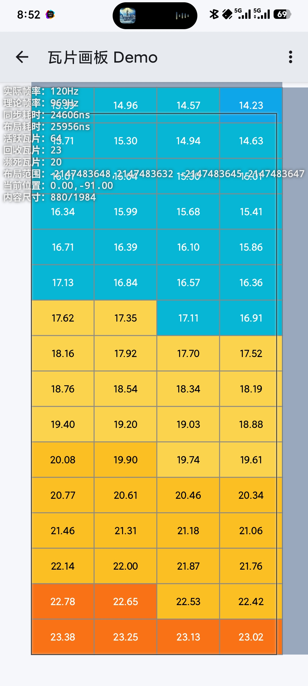
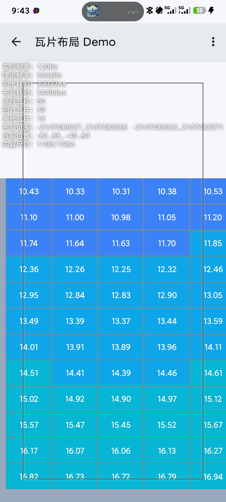
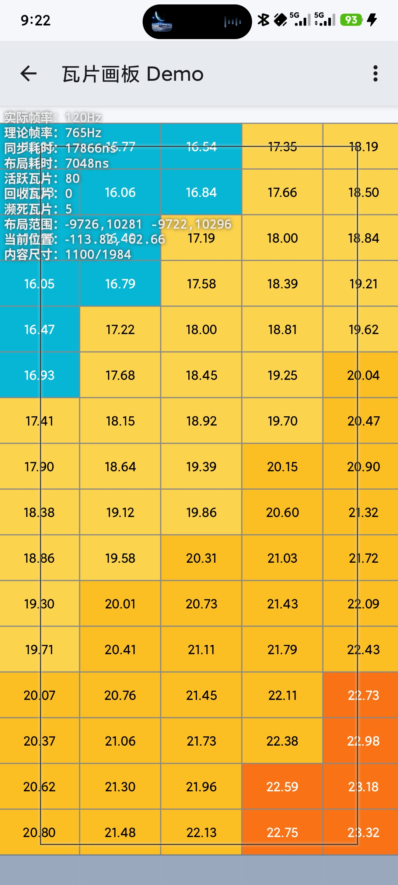
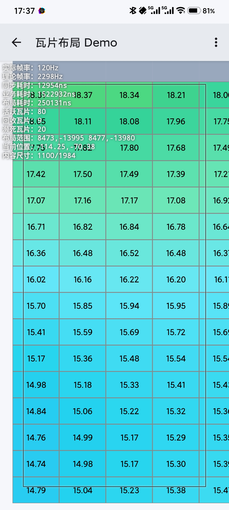
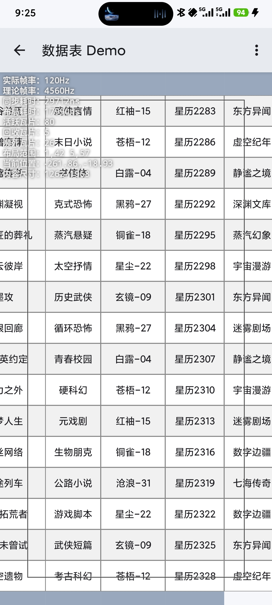
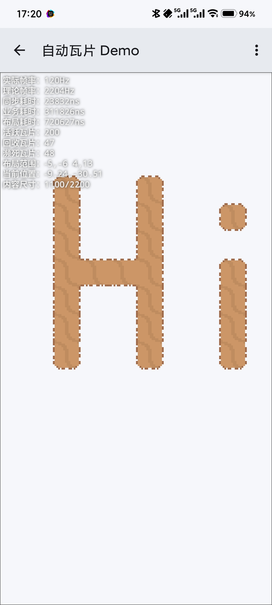
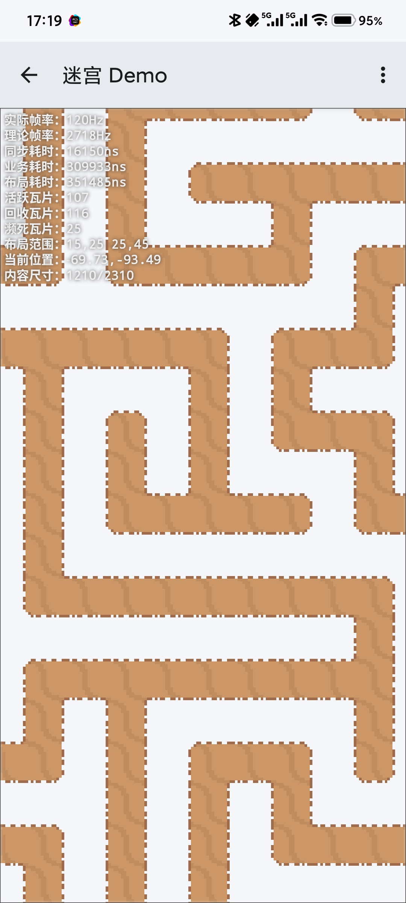
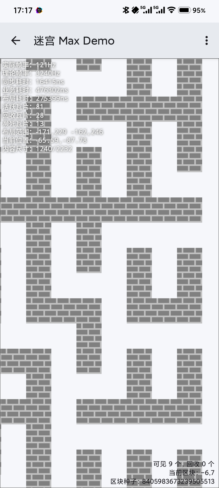

# Tile2D

在屏幕的方寸之间，铺展无限可能。

---

[](https://jitpack.io/#kkaHeng/tile2d)


## 简介

Tile2D 是一个支持**伪无限**索引空间的 Android 二维虚拟容器。

## 特性

- 只渲染**可见区域**，智能瓦片回收，内存占用恒定。
- 提供 **TileView(自定义绘制)** 和 **TileLayout(原生布局)** 两种实现。
- 支持**自定义**瓦片尺寸、边界范围和布局策略。
- 内置**性能监控**，实时显示 FPS、同步耗时、布局、瓦片统计、视口统计等信息。
- 简洁的 API 设计，快速上手，开箱即用。

> 理论上 TileView 性能更高，但我实测发现 TileLayout 开了硬件加速的性能更高，且交互支持好，代价是内存占用较高。

## 快速开始

### 添加依赖(Gradle)

在你的根目录 `settings.gradle` 文件的 `repositories` 末尾添加它：
```gradle
dependencyResolutionManagement {
    repositoriesMode.set(RepositoriesMode.FAIL_ON_PROJECT_REPOS)
    repositories {
        mavenCentral()
        google()
        maven { url 'https://jitpack.io' }
    }
}
```

引入依赖：
```gradle
dependencies {
    implementation 'com.github.kkaHeng:tile2d:26.6.1'
}
```

查看最新版本：[Jitpack](https://jitpack.io/#kkaHeng/tile2d)，或者点击页面顶部的徽章
> 版本号规则：年份.月份.大版本.小版本

### 基础使用

#### 使用 TileView（自定义绘制）

```java
TileView tileView = new TileView(context);
tileView.setAdapter(new TileView.Adapter() {
    @Override
    public TileView.TileHolder onCreateTileHolder(int type) {
        return new MyTileHolder();
    }

    @Override
    public void onBindTileHolder(TileView.TileHolder holder, int column, int row) {
        // 绑定数据
    }
});
```

#### 使用 TileLayout（标准 View）

```java
TileLayout tileLayout = new TileLayout(context);
tileLayout.setAdapter(new TileLayout.Adapter() {
    @Override
    public TileLayout.TileHolder onCreateTileHolder(int type) {
        return new MyTileHolder(new TextView(context));
    }

    @Override
    public void onBindTileHolder(TileLayout.TileHolder holder, int column, int row) {
        // 绑定数据
    }
});
```

## API 文档
### TileView 与 TileLayout

- `void offset(float dx, float dy)`
滚动一段距离。单位：**像素**。

- `void smoothOffset(float dx, float dy)`
平滑滚动一段距离。单位：**像素**。

- `void smoothOffset(float dx, float dy, int duration)`
平滑滚动一段距离并指定耗时。距离单位：**像素**，时间单位：**毫秒**。

- `void seek(int column, int row)`
跳转到指定位置。

- `void seek(int column, int row, float offsetX, float offsetY)`
跳转到指定位置并微调。单位：**像素**。

- `void snap()`
视窗吸附，用于适配器边界变化时使视窗进入合法范围内。

- `float getTileX(int column)`
获取指定列的横坐标。(基于View原点)

- `float getTileY(int row)`
获取指定行的纵坐标。(基于View原点)

- `int findColumn(float x)`
根据横坐标查找列。(基于View原点)

- `int findRow(float y)`
根据纵坐标查找行。(基于View原点)

- `TileLayoutModel getLayoutModel()`
获取当前视窗布局模型的快照(如果没有高频访问需求与实时更新需求，建议使用`newInstance`方法拷贝一份)。

- `void requestDisallowInterceptTouchEvent(boolean disallowIntercept)`
请求**TileView**或**TileLayout**放弃当前触摸事件序列，使瓦片获得完整事件序列。

- `long getLongPressTimeout()`
获取长按检测时长(仅**TileView**)。单位：**毫秒**。

- `void setLongPressTimeout(long longPressTimeout)`
设置长按检测时长(仅**TileView**)。单位：**毫秒**。

- `boolean isHorizontalScrollEnabled()`
检查是否开启横向滚动。

- `void setHorizontalScrollEnabled(boolean horizontalScrollEnabled)`
设置是否开启横向滚动。

- `boolean isVerticalScrollEnabled()`
检查是否开启纵向滚动。

- `void setVerticalScrollEnabled(boolean verticalScrollEnabled)`
设置是否开启纵向滚动。

- `int getTileWidth(int column)`
获取指定列的宽度。单位：**像素**。

- `int getTileHeight(int row)`
获取指定行的高度。单位：**像素**。

- `void setTileWidth(int column, int width)`
设置指定列的宽度。单位：**像素**。

- `void setTileHeight(int row, int height)`
设置指定行的高度。单位：**像素**。

- `void updateColumn(int column)`
更新指定列。

- `void updateRow(int row)`
更新指定行。

- `void update(int column, int row)`
更新指定瓦片。

- `void updateRange(int left, int top, int right, int bottom)`
更新指定范围。

- `void updateAll()`
更新视窗内所有瓦片。

- `Adapter getAdapter()`
获取适配器。

- `void setAdapter(Adapter adapter)`
设置适配器。

- `int getDefaultTileWidth()`
获取默认瓦片宽度。单位：**像素**。

- `int getDefaultTileHeight()`
获取默认瓦片高度。单位：**像素**。

- `void setDefaultTileWidth(int width)`
设置默认瓦片宽度。单位：**像素**。

- `void setDefaultTileHeight(int height)`
设置默认瓦片高度。单位：**像素**。

- `TileDimenProvider getDimenProvider()`
获取瓦片尺寸提供者。

- `void setDimenProvider(TileDimenProvider dimenProvider)`
设置瓦片尺寸提供者。

- `TileHolder getActiveTile(int column, int row)`
获取指定位置的瓦片(如果可见)，不可见时返回`null`。

- `boolean isEmpty()`
检查适配器边界是否为空。

- `boolean isAtLeftBound()`
检查视窗是否已触及左边界。

- `boolean isAtTopBound()`
检查视窗是否已触及上边界。

- `boolean isAtRightBound()`
检查视窗是否已触及右边界。

- `boolean isAtBottomBound()`
检查视窗是否已触及下边界。

- `boolean isInteractingWithView()`
检查用户是否正在和**TileView**或**TileLayout**交互，例如滚动。

- `boolean isDebugMode()`
检查是否已开启调试面板。

- `void setDebugMode(boolean enabled)`
设置是否开启调试面板。

### TileAdapter

- `int getLeftBound()`
获取左边界。

- `int getTopBound()`
获取上边界。

- `int getRightBound()`
获取右边界。

- `int getBottomBound()`
获取下边界。

- `T onCreateTileHolder(int type)`
根据**瓦片类型**创建瓦片持有者。

- `void onBindTileHolder(T holder, int column, int row)`
为瓦片持有者**绑定数据**。

- `int getTileType(int column, int row)`
获取指定瓦片的**瓦片类型**。

- `boolean isEmpty()`
检查边界是否为空。

### TileDimenProvider

- `int getTileWidth(int column)`
获取指定列的宽度。单位：**像素**。

- `int getTileHeight(int row)`
获取指定行的高度。单位：**像素**。

### Measurable

- `void measure(int widthMeasureSpec, int heightMeasureSpec, int[] out)`
测量瓦片并将瓦片尺寸写入数组中。

### MeasurableDimenProvider

- `boolean isMinDefault()`
是否使用默认尺寸保底。

- `void setMinDefault(boolean minDefault)`
设置是否使用默认尺寸保底，如果开启，测量结果小于默认尺寸时，使用默认尺寸。

- `void setDefaultTileWidth(int width)`
设置默认瓦片宽度。单位：**像素**。

- `void setDefaultTileHeight(int height)`
设置默认瓦片高度。单位：**像素**。

- `int getDefaultTileWidth()`
获取默认瓦片宽度。

- `int getDefaultTileHeight()`
获取默认瓦片高度。

- `void full()`
测量**全部瓦片**。不建议在大数据量时使用。

- `void measure(int colStart, int rowStart, int colEnd, int rowEnd)`
测量指定范围的瓦片。

- `void reset()`
清空已测量的全部结果。

- `void clearRecycledTiles()`
清空回收池。

## 瓦片生命周期

```
创建 → 绑定 → 进入窗口 → 离开窗口 → 濒死 → 回收 → 复用
```

## 性能优化

- **距离无关**：视窗所在位置的性能与**0**无关且恒定。通常不少传统算法在离**0**远的地方性能会变差。
- **伪无限**：支持完整的`int`全部索引空间。很多滚动容器并不支持这么大的范围，或仅支持正整数。
- **修改尺寸**：支持低成本修改任意位置的瓦片尺寸。
- **精度安全**：几乎没有精度问题，除非你的单个瓦片尺寸直接撞精度墙，不过在那之前，你的系统UI框架就会先报错。
- **null支持**：原生支持在`onCreateTileHolder`中返回`null`，在稀疏环境更省性能。
- **按需分配**：所有状态稀疏存储，不必申请大量用不上的内存空间。

## 许可证

本项目采用 [MIT License](LICENSE) 开源协议。

---

## 联系方式

- 作者：阿恒
- 邮箱：kkaheng163@163.com
- GitHub：[https://github.com/kkaHeng](https://github.com/kkaHeng)

---

## 性能报告
### 极端位置

正在贪婪的使用`int`的全部索引空间中：





### 普通示例

基于柏林噪声实现，可以提供伪无限的数据源。





### 数据表

一键测量全部数据，演示了可变列宽。



### 自动瓦片

类似游戏引擎中的摆放瓦片自动选择瓦片形态的功能。



### 迷宫生成

演示利用 **深度优先搜索(DFS)** 算法生成迷宫。



### 伪无限迷宫

区块化的伪无限迷宫，支持完整的`int`全部索引空间。



截图中的数据说明：
- **实际帧率**：真实的物理帧率（我的测试环境最高支持 120Hz）。
- **理论帧率**：根据渲染耗时推算的最高可持续帧率，远高于 120Hz 表示有余量。
- **同步/布局耗时**：处理滚动和行列计算的 CPU 时间，单位：纳秒（1ms = 1,000,000ns）。
- **活跃/回收/濒死瓦片**：可见瓦片数、缓存池瓦片数、视口外缓冲瓦片数。
- **布局范围**：当前可见区域的行列索引，截图中的极大值表示已处于 **int32** 的边界。
- **当前位置**：当前可见区域的像素级偏移，你会发现它总是很小。