# Tile2D

Within the confines of a screen, unfold the infinite.

---

[](https://jitpack.io/#kkaHeng/tile2d)

English | [汉语](README.md)

## Introduction

Tile2D is an Android 2D virtual container supporting a **pseudo-infinite** index space.

## Features

### Viewport Culling

Tiles outside the viewport are **not loaded** and **not rendered**. A `RecyclerView`-style **adapter pattern** keeps the learning curve low, because `RecyclerView` is a mountain every Android developer has to climb.

**Virtualized** rendering is the key to sustained high performance: it prevents performance from degrading linearly with total data volume — the baseline requirement for any scrolling container.

### Dual Rendering Paradigms

Two **default** rendering paradigms are provided: `TileLayout` supports **native Views**, while `TileView` renders with `Canvas`.

Few UI frameworks accommodate different UI ecosystems: they either build their own UI stack, or support native Views only. Supporting **choice** and **extensibility** of rendering/interaction paradigms removes the **ecosystem migration cost**.

### Range Support

The adapter's **logical index range** covers the full **int32** space — about **4.2 billion** per axis.

Many traditional paradigms do not support `Integer.MAX_VALUE`, not even negative indices. That is a consequence of **array thinking**, the **half-open interval** convention, and the habit of downplaying the existence of **logical indices/coordinates**.

### Dying & Prefetch

Two complementary caching strategies: the **dying zone** (keeping recently departed tiles) and the **prefetch zone** (loading ahead of movement).

Tiles leaving the viewport are **staged**; scrolling back **skips rebinding** and revives them directly. Prefetch is **enabled by default**: it predicts the **direction of motion**, extends a strip only ahead of the viewport, and preloads in batches (up to 8 per frame, tunable). Tiles are promoted straight into the window on entry, avoiding one-shot loading stalls.

### Variable Sizes

Supports **low-cost** resizing of specific rows and columns; modifying sizes outside the window costs even less.

When resizing, a custom **alignment direction** lets the row/column itself stay put while the other side **expands** or **shrinks**.

In many traditional paradigms, **size** and **coordinates** are heavily coupled: resizing triggers massive **coordinate recalculation** and severe performance issues.

### Precision Safety

When the window sits near the **int32** boundary, or very far from **zero**, pixel precision does not degrade.

The only exception is a **single tile** hitting the **precision wall** directly — but virtually no UI system supports textures that large, and splitting content across tiles avoids the problem anyway.

Many traditional algorithms lose precision when scrolled far from the origin, producing **visual jitter**: overlapping tiles, oversized gaps, or distorted line widths.

### Container Replacement

The underlying **data containers** are replaceable in pursuit of higher performance ceilings: the **tile pool**, **size table**, **recycle pool**, and more. Based on simple custom interfaces, they can be freely combined with **third-party data structures**.

For example, `HashMap` is fast but suffers **boxing/unboxing** overhead, while `SparseArray` avoids boxing but is slower. The framework's **default** data structure combines the strengths of both.

### Sparse Storage

The framework never allocates arrays for space it will not use. **Sparse data** is supported across the entire chain — for instance, `onCreateTileHolder` may **safely return `null`**.

Tile containers, size tables, and other structures are all sparsely stored: unused positions simply **do not exist**, rather than holding `null`.

---

## Getting Started

### Adding the Dependency (Gradle)

Add this to the end of `repositories` in your root `settings.gradle` file:
```gradle
dependencyResolutionManagement {
    repositoriesMode.set(RepositoriesMode.FAIL_ON_PROJECT_REPOS)
    repositories {
        mavenCentral()
        google()
        maven { url 'https://jitpack.io' }
    }
}
```

Add the dependency:
```gradle
dependencies {
    implementation 'com.github.kkaHeng:tile2d:26.8.1'
}
```

For the latest version, see [Jitpack](https://jitpack.io/#kkaHeng/tile2d) or click the badge at the top of the page.
> Version scheme: year.month.major.minor

### Basic Usage

#### Using TileView (Custom Drawing)

```java
TileView tileView = new TileView(context);
tileView.setAdapter(new TileView.Adapter() {
    @Override
    public TileView.TileHolder onCreateTileHolder(int type) {
        return new MyTileHolder();
    }

    @Override
    public void onBindTileHolder(TileView.TileHolder holder, int column, int row) {
        // Bind data
    }
});
```

#### Using TileLayout (Standard Views)

```java
TileLayout tileLayout = new TileLayout(context);
tileLayout.setAdapter(new TileLayout.Adapter() {
    @Override
    public TileLayout.TileHolder onCreateTileHolder(int type) {
        return new MyTileHolder(new TextView(context));
    }

    @Override
    public void onBindTileHolder(TileLayout.TileHolder holder, int column, int row) {
        // Bind data
    }
});
```

The adapter **defaults** to the **minimum** and **maximum** values of **int32** — the complete space. Override the following methods in your adapter for a **custom** data range. Bounds are **closed intervals**: the bounds themselves are **valid coordinates**.

```java
// From -10,-10 to 10,10: 21 columns, 21 rows, 441 cells in total
@Override
public int getLeftBound() {
    return -10; // Left bound
}

@Override
public int getTopBound() {
    return -10; // Top bound
}

@Override
public int getRightBound() {
    return 10; // Right bound
}

@Override
public int getBottomBound() {
    return 10; // Bottom bound
}
```

---

## Architecture

### Diagram

```
Rendering & interaction layer
    ↑
  Core layer------------┬------------┬------------┐
    ↓            Gesture handling  Tile management  Size management
 Layout engine
```

### Upper Layer

This layer is the final carrier of **rendering** and **interaction** — the outermost shell, analogous to **hands, feet and touch**. It governs how tiles **enter and leave the viewport** and how events are handled.

Representative classes: `TileView`, `TileLayout`.

**Beginners** and most business needs only need this layer. `TileLayout` is recommended for newcomers; its performance is close behind, at slightly higher memory usage.

### Middle Layer

This layer is the **central hub**, analogous to the **nervous system**: it receives input from the **upper layer**, forwards it to the **lower layer**, and notifies the **upper layer** to react.

Representative class: `TileCoreService`.

### Lower Layer

This layer is the **brain** of the framework, handling the complex work of **window movement**, **tile management**, **size management**, and **gesture handling**.

Representative classes: `LayoutEngine` (window movement), `TileManager` (tile management), `DimenManager` (size management), `EventHandler` (gesture handling).

---

## Lifecycle

```
Create/reuse → Bind → Prefetch (optional) → Enter viewport → Leave viewport → Dying (optional) → Recycle
```

---

## License

This project is licensed under the [MIT License](LICENSE).

---

## Further Reading

- [API Documentation](docs/en/API.md) — Detailed usage reference.
- [Android Platform Extension Guide](docs/en/Android_Platform_Extension_Guide.md) — How to extend/migrate within the Android platform.
- [Cross-Platform Porting Guide](docs/en/Cross_Platform_Porting_Guide.md) — How to implement the engine on other platforms.
- [H5 Porting Guide (DOM)](docs/en/H5_Porting_Guide.md) — A complete porting tutorial for the browser, with a runnable example (h5-demo/).

---

## Contact

- Author: 阿恒 (AhHeng)
- Email: kkaheng163@163.com
- GitHub: [https://github.com/kkaHeng](https://github.com/kkaHeng)

---

## Sample Demos

The app ships with **10 samples** covering both rendering paradigms (Canvas self-drawing / standard Views) and a variety of scenarios.

- **Debug Mode**
Live display of **active**, **recycled**, and **dying tile** debug info.

- **Pseudo-Infinite Mode**
Data bounds expand to the full **int32** range. Some demos use algorithms and **deterministic pseudo-random generators** to synthesize data on demand.

- **To the Boundary**
One-tap jumps to the 8 extreme points of the data bounds. Combined with **pseudo-infinite mode**, the effect is dramatic.

### Tile Canvas (TileView)

A noise-texture demo based on **TileView (Canvas self-drawing)** — the minimal example for understanding the self-drawing paradigm.

- Data: `PerlinNoise2D` sampling with a fixed seed, mapped by `ColorGenerator` to a 24-color gradient; low-noise areas return `-1`, producing sparse empty tiles
- Optimization: tile content is recorded into a `Picture` and replayed, avoiding repeated drawing
- Interaction: long-press to delete a tile (partial refresh), random column width/row height animation, switch between color-block and text plans

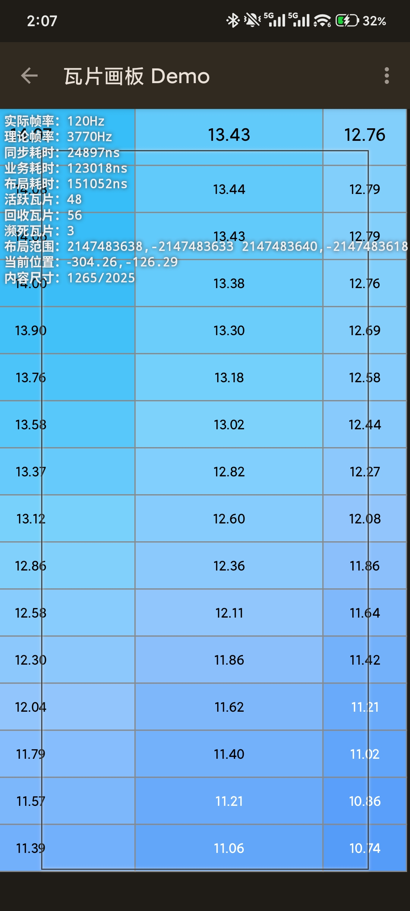

### Tile Layout (TileLayout)

The same noise data source rendered by **TileLayout (ViewGroup)**, where every tile is a real `View`.

- Data: the same noise source as the canvas demo
- Rendering: tiles are individual `TextView`s driven by the hardware-accelerated pipeline; native click/long-press support
- Contrasted with the canvas demo, it shows the difference between **Canvas self-drawing** and the **View hierarchy** on the same engine

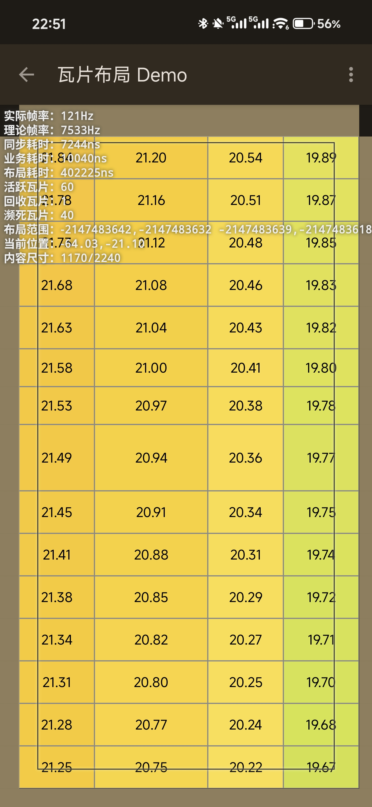

### Data Table

A **plain-text table (CSV) editor** built on **TileLayout**, with the underlying data kept as human-readable plain text, demonstrating the tile engine in data visualization and editing scenarios.

- Data: a built-in default dataset of the **periodic table** (118 elements × 13 dimensions), stored as plain-text CSV in the private directory, copied from assets on first launch, and resettable from the top-right menu
- Rendering: `MeasurableDimenProvider` auto-measures column widths / row heights; header and body use two TextView styles, each occupying one tile type; body rows are **zebra-striped** by parity; scaling is vector-based and stays crisp
- Editing: tap a cell to open a Material3 input dialog, saving persists to the file immediately; long-press a cell for a menu (delete column/row, move column left/right, move row up/down)
- Text: bottom buttons "Copy All" (choose TSV or CSV to copy to clipboard) and "Parse" (choose TSV or CSV to replace the whole table); new columns/rows seek into view automatically

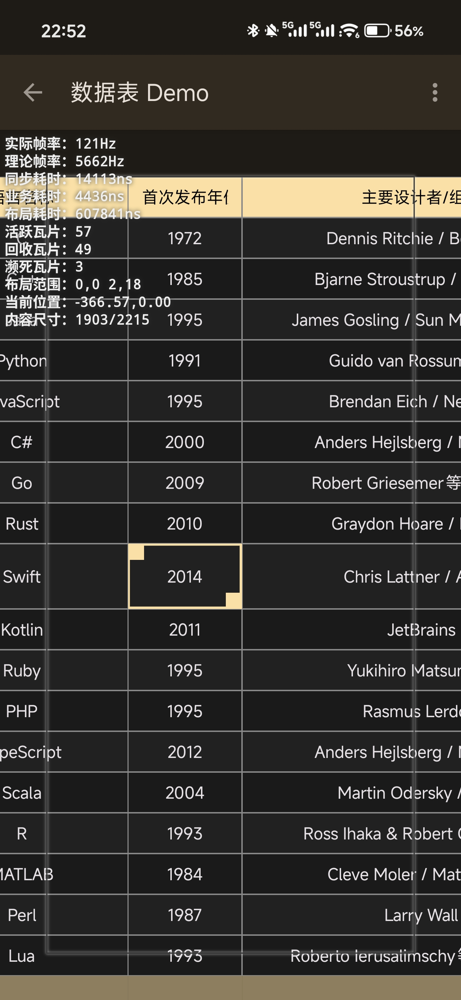

### Auto Tiles

An auto-tiling system built on **TileLayout**, similar to a tile-map editor in game engines.

- Data: 47 tile types cut from `dirt_tileset.png` (nearest-neighbor upscaling preserves the pixel-art look)
- Algorithm: `SimpleConnectionRule` neighbor detection in four directions, composing a 4-bit mask mapped to 16 connection shapes
- Interaction: drag to paint, tile-shatter particle animation, bounce-in animation

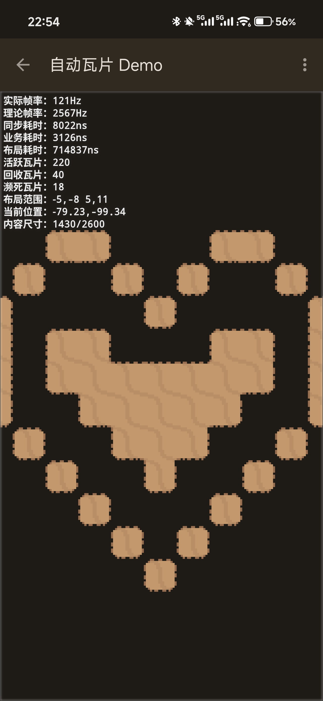

### Maze Generation

A recursive backtracking (DFS) algorithm generates mazes in real time, showcasing TileLayout's dynamic update capability.

- Algorithm: 51x51 grid, expand with step 2, carve walls with step 1, recursive backtracking in random directions
- Data: the same tile set and connection rules as the auto-tiles demo
- Scenario: step-by-step visualization of generation (variable speed for advance/backtrack), smooth camera follow, `updateRange` partial refresh

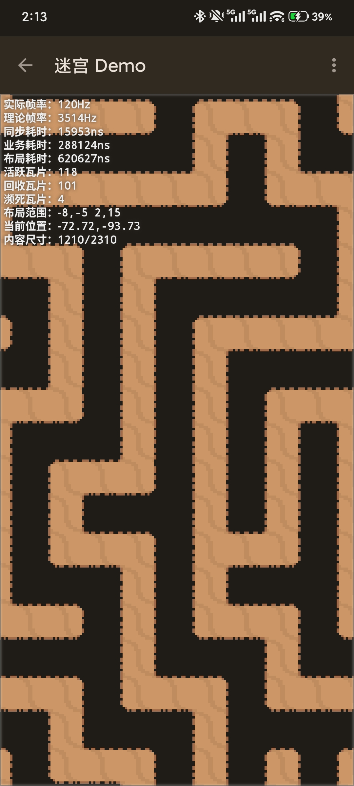

### Infinite Maze

A chunk-driven infinite maze system, demonstrating Tile2D's capacity for massive coordinate spaces.

- Algorithm: recursive division for walls; `SplitMix64` mixes the seed with chunk coordinates so the same chunk is reproducible
- Data: 32x32 chunks, 4-thread async generation, chunk pool recycling
- Scenario: chunks load/recycle as the viewport scrolls; supports about 134 million chunks

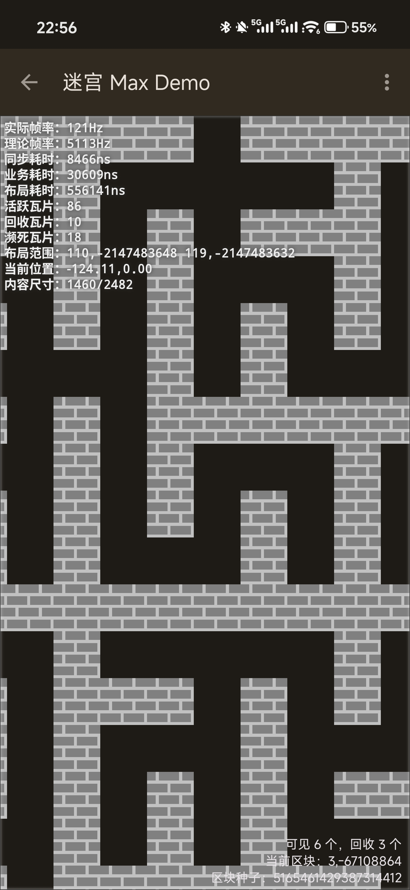

### Minesweeper

A complete Minesweeper game based on **TileView (Canvas drawing)**.

- Algorithm: `SplitMix64` hash-based deterministic mine placement (~15.6% density), BFS flood-fill of blank areas, 15 pre-recorded vector-drawn state appearances
- Data: first click opens a 3x3 safe zone; default bounds 61x61, pseudo-infinite mode spans full int32
- Scenario: flag/reveal, save/load, AI auto-solver, camera follow

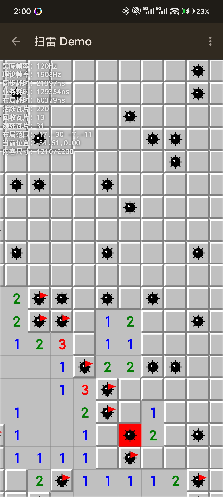

### Gomoku (Five in a Row)

A complete Gomoku game based on **TileView (Canvas drawing)**.

- Board: finite mode 201×201 (nine star points); pseudo-infinite mode spans full int32; five-in-a-row wins in both modes
- AI: classic pattern scoring + alpha-beta pruning — actively blocks threats; constant thinking time that does not grow as the game lengthens; randomized responses, so identical opening lines do not repeat
- Scenario: two players on one screen, human vs AI; with "AI auto-play" on, both sides are played by the AI; the camera smoothly follows the latest stone; one-tap copy of the move log

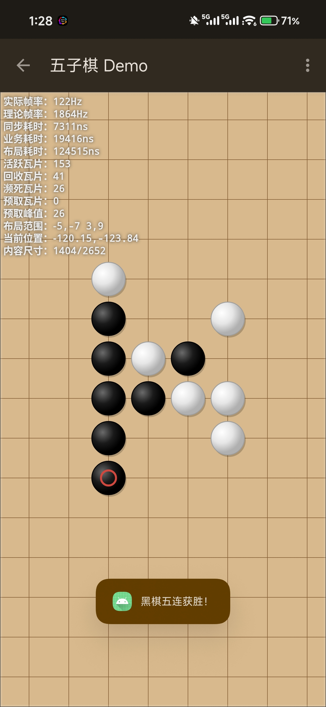

### Benchmarks

A pure-algorithm benchmark operating directly on the `LayoutEngine` core layer (**zero Android view overhead**), validating the layout engine's raw performance ceiling.

- Sync (scroll) test: loops `engine.sync()` with random displacement vectors
- Seek (jump) test: loops `engine.seek()` over random full-int32 coordinates
- Extreme boundary jumps: random jumps to the 8 int32 boundary directions, reporting elapsed time and `in()`/`out()` call counts
- Metrics: mean, min, max, median, P95, P99, total time, and throughput (ops/s)

1. Sync (scroll) test — statistics over repeated random offsets: mean, P95, P99, and throughput
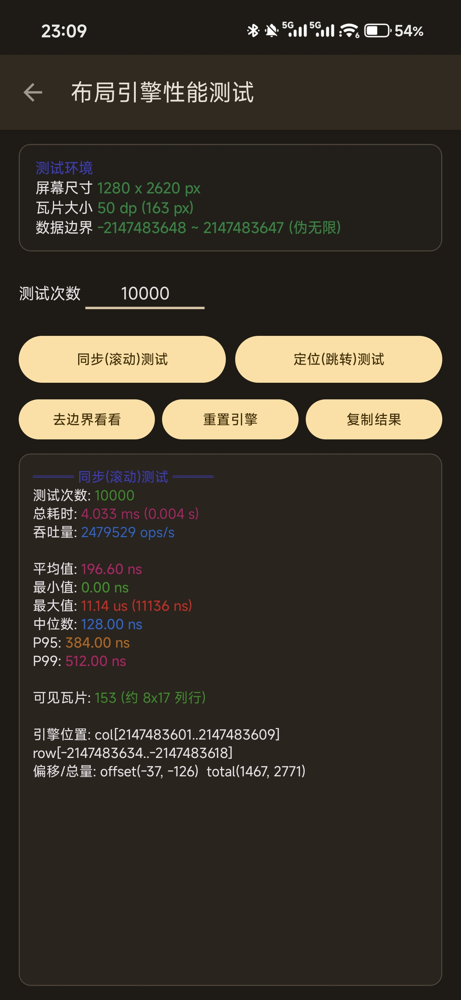

2. Seek (jump) test — random seeks across the full int32 space, testing long-distance jump performance
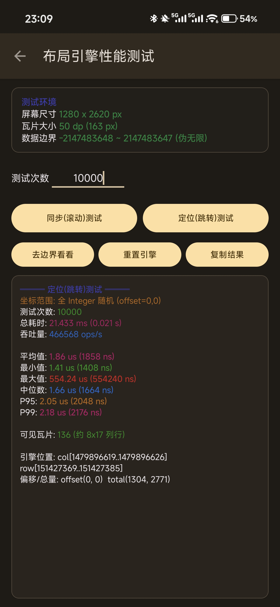

3. Extreme boundary jumps — a single jump from the current position to an int32 boundary, recording time and in/out call counts
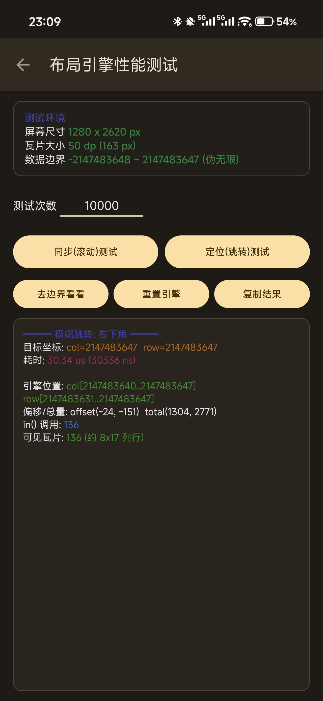

Debug-mode field notes:
- **Actual FPS**: the real physical frame rate (`Choreographer.FrameCallback`, sampled once per second, in `Hz`).
- **Theoretical FPS**: the maximum sustainable frame rate extrapolated from draw time (`Debug.threadCpuTimeNanos`); far above the display refresh rate means rendering headroom.
- **Sync time**: viewport sync computation time of `LayoutEngine.sync` (from `LayoutModel.syncTime`), in **nanoseconds** (1ms = 1,000,000ns).
- **Bind time**: tile binding time of `onBindTileHolder` (collected via `Callback.getBindTime()`), in **nanoseconds**.
- **Layout time**: viewport tile layout and dying-zone processing time (collected via `Callback.getLayoutTime()`), in **nanoseconds**.
- **Active tiles**: tiles currently visible in the viewport.
- **Recycled tiles**: tiles cached in the recycle pool awaiting reuse.
- **Dying tiles**: tiles that just left the viewport and are still buffered in the dying zone.
- **Layout range**: the closed interval of row/column indices currently visible; extreme values in the screenshot mean the viewport is already at the **int32** boundary.
- **Current position**: the pixel-level offset of the visible area (`offsetX`, `offsetY`) — you will notice it is always tiny.
- **Content size**: total pixel width/height from the start column/row to the end column/row (`totalWidth / totalHeight`).

### Window Paradigm

A **pure interaction demo** that does not hook up the real engine: two draggable color strips contrast how traditional containers and Tile2D locate the viewport.

- Traditional paradigm: absolute coordinate positioning — the viewport is a **magnifier rolling along a ruler**, and the viewport is what moves; coordinate range `[0, total content size]`
- Tile2D paradigm: logical coordinates + pixel offset — the viewport is a **camera fixed in place**, and the content is what moves; offset range `[-tile size, 0]`, matching the `offsetX` semantics of `LayoutEngine`
- Scenario: drag + inertial scrolling with a live viewport-offset readout, to build intuition for converting between the two positioning paradigms

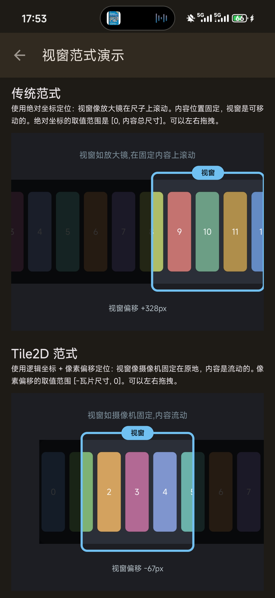

---

Only in a world that holds together do we find each other.

---